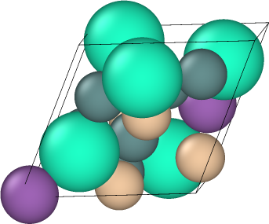
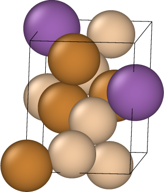
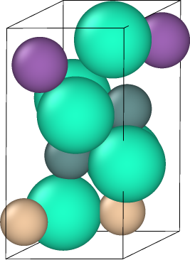
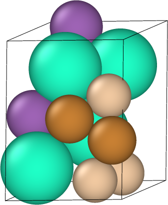
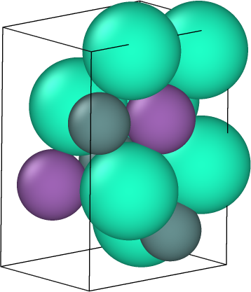
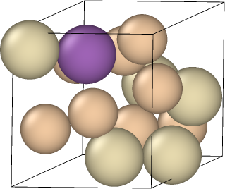

# Solving Offline Materials Optimization with CliqueFlowmer

<p align="center">
  <sub><strong>Jakub Grudzien Kuba, Ben Kurt Miller, Sergey Levine, Pieter Abbeel</strong></sub>
</p>

<p align="center">
  
</p>

<p align="center">
  <a href="https://arxiv.org/pdf/2603.06082"><strong>Paper</strong></a>
</p>

---

## ✦ Materials discovered by CliqueFlowmer

<p align="center">
  
  
  
  
  
  
  
</p>

<p align="center">
  <sub>Examples of optimized crystal structures produced by CliqueFlowmer.</sub>
</p>

---

## Overview

CliqueFlowmer is a model for **offline computational materials optimization**.

Instead of only generating materials, it:

- encodes crystal structures into a latent space
- optimizes that latent space using evolution strategies
- decodes optimized latents back into new candidate materials

This repository contains the reference implementation for
[*Offline Materials Optimization with CliqueFlowmer*](https://arxiv.org/pdf/2603.06082).

---

## ✦ Model illustration

<p align="center">
  
</p>

<p align="center">
  <sub>CliqueFlowmer pipeline: encode materials, optimize latent representations, and decode them back into crystal structures.</sub>
</p>

---

## Workflow

1. preprocess a dataset of materials and target properties
2. train CliqueFlowmer
3. optimize latent representations
4. decode and evaluate candidate materials

---

## Repository Structure

```text
models/
  cliqueflowmer.py        # main model (encoder + predictor + decoders)
  transformer.py          # transformer backbone
  flow.py                 # flow-based geometry decoder

architectures/
  ...                     # shared building blocks

optimization/
  learner.py              # ES / gradient learners
  design.py               # latent optimization loop
  sun.py                  # S.U.N. evaluation

data/
  tools.py                # dataset and preprocessing utilities
  constants.py            # atomic metadata

configs/
  mp20/                   # default configuration
  mp20-bandgap/           # band gap optimization configuration

scripts/
  train.py                # training entrypoint
  optimize.py             # material discovery
```

---

## Setup

### Environment

```bash
python -m venv .venv
source .venv/bin/activate
pip install -U pip
pip install -r requirements.txt
```

### Storage

Expected structure:

```text
CliqueFlowmer/
  data/
    preprocessed/<task_name>/
  models/
    states/<model_name>/<task_name>/
```

If you want to use the training and optimization scripts, you will also need:

- a Weights & Biases account
- a Google bucket for data and model states

---

## Training

```bash
CUDA_VISIBLE_DEVICES=0,1,2,3,4,5,6,7 \
torchrun \
  --nproc_per_node=8 \
  --nnodes=1 \
  --node_rank=0 \
  --master_addr=localhost \
  --master_port=12346 \
  train.py
```

---

## Material Discovery

```bash
CUDA_VISIBLE_DEVICES=0,1,2,3,4,5,6,7 \
python optimize.py
```

---

## Outputs

After running optimization, you should obtain:

- generated crystal structures
- evaluated target properties
- S.U.N. metrics (stability / uniqueness / novelty)

---

## Citation

```bibtex
@article{kuba2026offline,
  title={Offline Materials Optimization with CliqueFlowmer},
  author={Kuba, Jakub Grudzien and Miller, Benjamin Kurt and Levine, Sergey and Abbeel, Pieter},
  journal={arXiv preprint arXiv:2603.06082},
  year={2026}
}
```